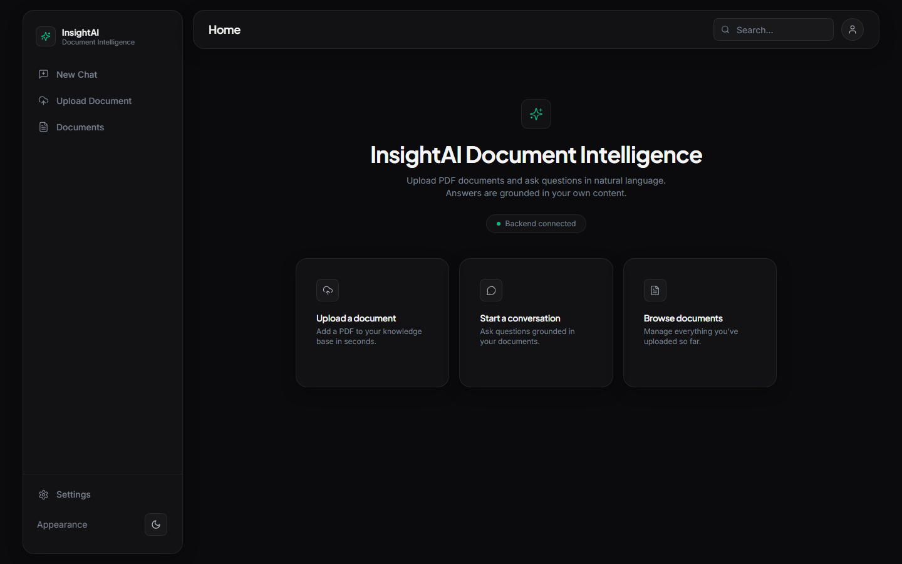
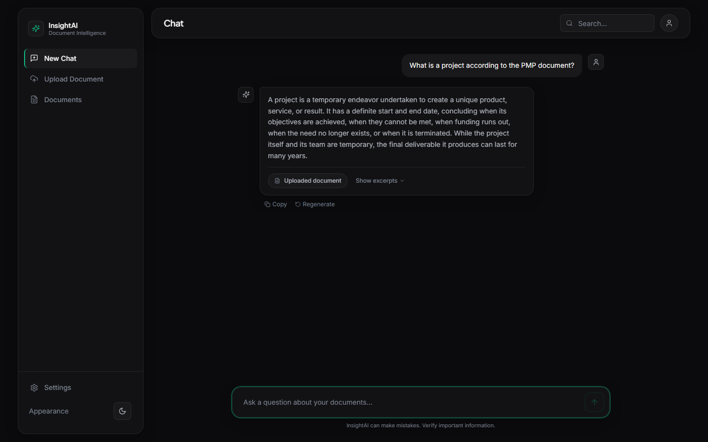
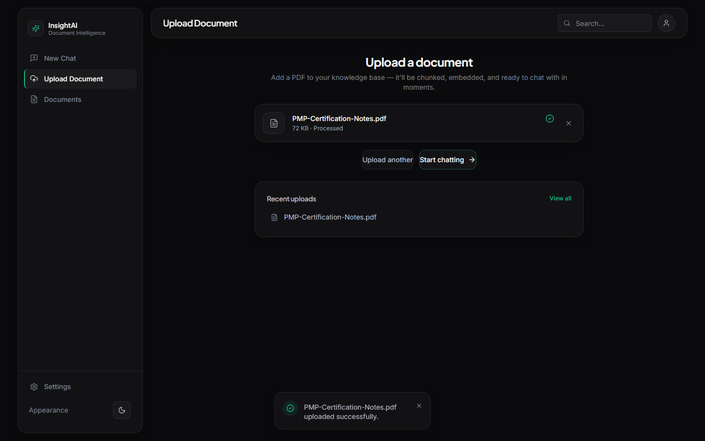
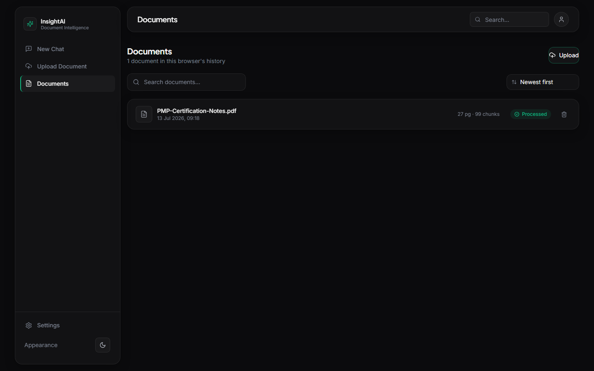
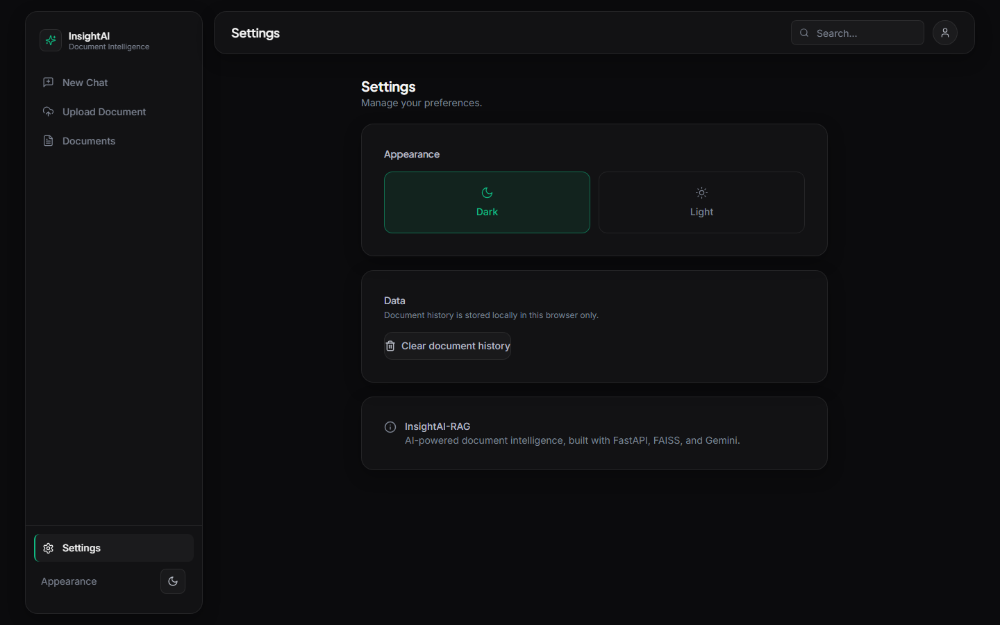

<div align="center">

# InsightAI-RAG

**Upload a PDF. Ask it questions. Get answers grounded in what it actually says.**

InsightAI-RAG is a full-stack Retrieval-Augmented Generation app: a FastAPI backend that chunks and embeds your documents into a FAISS vector index, and a React SPA for uploading files and chatting with them — with every answer traceable back to the source passage.

[](LICENSE)


</div>

<br>



## Table of contents

- [How it works](#how-it-works)
- [Features](#features)
- [Screenshots](#screenshots)
- [Tech stack](#tech-stack)
- [Getting started](#getting-started)
- [Configuration](#configuration)
- [API reference](#api-reference)
- [Evaluation](#evaluation)
- [Project structure](#project-structure)
- [Known limitations](#known-limitations)
- [Future work](#future-work)
- [License](#license)

## How it works

```
                    ┌──────────────┐
   PDF upload  ───▶ │  PyMuPDF     │  extract text per page
                    └──────┬───────┘
                           ▼
                    ┌──────────────┐
                    │  Chunking    │  langchain-text-splitters
                    │  (1000 chars,│  200 char overlap
                    │   overlap)   │
                    └──────┬───────┘
                           ▼
                    ┌──────────────┐
                    │  Embeddings  │  Sentence Transformers
                    │              │  (all-MiniLM-L6-v2)
                    └──────┬───────┘
                           ▼
                    ┌──────────────┐
                    │  FAISS index │  persisted to disk,
                    │ (IndexFlatIP)│  cosine similarity search
                    └──────┬───────┘
                           ▼
   Question    ───▶ ┌──────────────┐     top-k chunks     ┌──────────────┐
   in chat          │  Retrieval   │ ───────────────────▶ │    Gemini    │ ──▶ Answer + cited sources
                     └──────────────┘                      └──────────────┘
```

A document uploaded through `/upload` is chunked, embedded, and written into the same in-memory FAISS index that `/chat` queries — so a new document is searchable immediately, no reload or reindex step required.

## Features

- **Drag-and-drop PDF ingestion** — validated for type and size, chunked with configurable overlap, embedded, and indexed in one request.
- **Grounded chat** — every answer is generated only from retrieved chunks, with the source document and matched excerpts shown alongside the response.
- **Conversational query routing** — small talk and meta-questions are handled without spending a retrieval + generation round trip on them.
- **Document management** — browse everything you've uploaded, see page/chunk counts, and delete a document (which also removes its vectors from the index).
- **Light & dark themes**, keyboard-friendly chat input, and toast notifications throughout.
- **Structured JSON logging** and a typed exception hierarchy that maps domain errors (corrupted PDF, empty vector store, LLM timeout, ...) to the correct HTTP status code.

## Screenshots

<table>
<tr>
<td width="50%">

**Chat, grounded in your documents**
Every answer links back to the excerpt it came from.



</td>
<td width="50%">

**Upload**
Drag, drop, done — chunked and embedded in seconds.



</td>
</tr>
<tr>
<td width="50%">

**Documents**
Everything in your knowledge base, at a glance.



</td>
<td width="50%">

**Settings**
Light or dark, your call.



</td>
</tr>
</table>

## Tech stack

| | |
|---|---|
| **Backend** | FastAPI, Pydantic v2 (`pydantic-settings`), Uvicorn |
| **Document parsing** | PyMuPDF |
| **Chunking** | `langchain-text-splitters` |
| **Embeddings** | Sentence Transformers (`all-MiniLM-L6-v2`) |
| **Vector store** | FAISS (`IndexFlatIP`, cosine similarity) |
| **LLM** | Google Gemini (`google-genai`) |
| **Frontend** | React 18, Vite, Tailwind CSS, Framer Motion, React Router |
| **Testing** | Pytest |

## Getting started

### Prerequisites

- Python 3.11+
- Node.js 18+
- A [Gemini API key](https://ai.google.dev/)

### Backend

```bash
cd backend
pip install -r requirements.txt
cp .env.example .env        # then set GEMINI_API_KEY
uvicorn app.main:app --reload
```

The API is now running at `http://localhost:8000` (interactive docs at `/docs`).

### Frontend

```bash
cd frontend
npm install
cp .env.example .env        # defaults to http://localhost:8000
npm run dev
```

The app is now running at `http://localhost:5173`.

### Running tests

```bash
cd backend
pytest
```

## Configuration

All backend configuration lives in `backend/.env` (see `backend/.env.example`), loaded via `pydantic-settings`:

| Variable | Default | Description |
|---|---|---|
| `GEMINI_API_KEY` | — | **Required.** Your Google Gemini API key. |
| `API_KEY` | — | **Required.** Shared secret clients must send in the `X-API-Key` header to reach the documents/chat routers. |
| `FRONTEND_URL` | `http://localhost:5173` | Origin allowed by CORS. |
| `MAX_UPLOAD_SIZE_MB` | `20` | Maximum accepted PDF size. |
| `CHUNK_SIZE` / `CHUNK_OVERLAP` | `1000` / `200` | Characters per chunk / overlap between chunks. |
| `EMBEDDING_MODEL_NAME` | `all-MiniLM-L6-v2` | Sentence Transformers model. |
| `RETRIEVAL_TOP_K` | `5` | Chunks retrieved per query by default. |
| `RETRIEVAL_MIN_SCORE` | `0.3` | Minimum cosine similarity to keep a retrieved chunk. |
| `GEMINI_MODEL_NAME` | `gemini-3.5-flash` | Gemini model used for answer generation. |
| `GEMINI_TIMEOUT_SECONDS` | `30` | Timeout for Gemini API calls. |
| `COST_PER_1K_TOKENS` | `0.00025` | Estimated USD cost per 1,000 tokens for Gemini, used only to log a rough per-generation cost estimate — not billed usage. |
| `LLM_PROVIDER` | `gemini` | Which provider `/chat` and `/summarize` use: `gemini` or `groq`. Both implement the same `LLMClient` interface (see `services/llm_provider.py`). |
| `FALLBACK_LLM_PROVIDER` | — | Optional. If set to the other provider, `FallbackLLMClient` retries against it after the primary's own retries are exhausted. |
| `GROQ_API_KEY` | — | Required only if `LLM_PROVIDER` or `FALLBACK_LLM_PROVIDER` is `groq`. |
| `GROQ_MODEL_NAME` | `llama-3.3-70b-versatile` | Groq model used for text generation. |
| `GROQ_TIMEOUT_SECONDS` | `30` | Timeout for Groq API calls. |
| `GROQ_COST_PER_1K_TOKENS` | `0.0006` | Estimated USD cost per 1,000 tokens for Groq. |

The frontend reads from `frontend/.env`:

| Variable | Default | Description |
|---|---|---|
| `VITE_API_BASE_URL` | `http://localhost:8000` | Backend base URL. |
| `VITE_API_KEY` | — | Sent as the `X-API-Key` header on every request; must match the backend's `API_KEY`. |

## API reference

Every endpoint except `/health` requires an `X-API-Key` header matching
the backend's `API_KEY` setting — a missing or wrong key returns `401`.

| Method | Endpoint | Auth | Description |
|---|---|---|---|
| `GET` | `/health` | — | Liveness check. |
| `POST` | `/upload` | required | Upload a PDF — extracts, chunks, embeds, and indexes it. |
| `DELETE` | `/documents/{document_id}?confirm=true` | required | Remove a document and its vectors from the index. |
| `POST` | `/chat` | required | Ask a question; returns an answer grounded in retrieved chunks. |

**`DELETE /documents/{document_id}`** requires the `confirm=true` query
parameter as an explicit confirmation step — omitting it returns `400`
(`Confirmation Required`) instead of deleting.

**`POST /chat`** request body:

```json
{
  "query": "What is a project according to the PMP document?",
  "top_k": 5,
  "min_score": 0.3,
  "history": [
    { "role": "user", "content": "What is a project?" },
    { "role": "assistant", "content": "A temporary endeavor..." }
  ]
}
```

`history` is optional — prior conversation turns, oldest first, each
`{ "role": "user"|"assistant", "content": string }`. Only the most recent
6 are used.

response:

```json
{
  "answer": "A project is a temporary endeavor undertaken to create a unique product, service, or result...",
  "retrieved_chunks": [
    { "chunk_id": "...", "document_id": "...", "text": "...", "score": 0.65, "metadata": { "...": "..." } }
  ],
  "sources": ["ae845151-86b1-41e8-a63b-69289b88c67a"],
  "processing_time": 18.24,
  "tool_used": "retrieval",
  "steps_taken": 3
}
```

`tool_used` is one of `"retrieval"`, `"summarization"`, or `"none"`
(small-talk queries answered without touching the document index or the
LLM). `steps_taken` counts the agent's internal steps for that request
(planning, retrieval/summarization, generation, plus one more if the
reflection self-correction step fired) — see `docs/ARCHITECTURE.md`.

Every response also carries an `X-Request-ID` header (generated, or
echoed back if you send one) for correlating a request against the
backend's structured logs.

Full interactive documentation (generated by FastAPI) is available at `/docs` while the backend is running.

## Evaluation

`backend/eval/` has three independent tools:

- **`run_eval.py`** — runs a 16-entry dataset (`dataset_v1.json`) through
  the real `ChatService` and reports planner routing accuracy (confusion
  matrix, precision/recall/F1), Task Success Rate, a groundedness proxy,
  and Injection Resistance. Requires a live `GEMINI_API_KEY` and at least
  one indexed document.
- **`metrics_report.py`** — parses the backend's own JSON logs into
  latency percentiles, error rate by taxonomy category, and total
  token/cost usage. A local stand-in for real observability, not a
  replacement for it.
- A manual rubric — [`docs/HUMAN_EVAL.md`](docs/HUMAN_EVAL.md) defines a
  1-5 scoring rubric (correctness, helpfulness, completeness, safety,
  tone, groundedness, citation quality) over the same dataset, for the
  subjective quality the automated metrics above don't capture.

See `backend/eval/README.md` for exact usage, metric definitions, and the
dataset versioning convention, and
[`docs/DESIGN_REVIEW.md`](docs/DESIGN_REVIEW.md) (Q6) for how this fits
into the overall evaluation approach.

## Project structure

```
InsightAI-RAG/
├── backend/
│   └── app/
│       ├── api/v1/routes/     # health, documents, query
│       ├── core/              # config, logging, exceptions, error handlers
│       ├── models/            # Pydantic schemas
│       └── services/          # chunking, embedding, FAISS store, RAG pipeline, Gemini client
└── frontend/
    └── src/
        ├── pages/              # Home, Upload, Chat, Documents, Settings
        ├── components/         # chat/, upload/, layout/, ui/
        ├── hooks/              # useChat, useUpload, useTheme, useToast
        └── services/           # api client, chat/document services
```

## Known limitations

- **Single, unsharded FAISS index.** One `backend/vector_store/index.faiss`
  file serves every document, loaded as a single process-wide instance —
  no per-tenant isolation, and no locking around concurrent writes.
- **Single shared API key.** No per-user credentials, key rotation, or
  rate limiting.
- **Document history is per-browser, not server-side.** There's no
  document-listing endpoint; the Documents page reads `localStorage`, so
  a different browser or device shows nothing even though the documents
  are indexed server-side.
- **Chat history isn't persisted at all.** Kept only in React state
  client-side and sent per-request (last 6 turns); a page refresh loses
  the conversation.
- **No OCR.** PDF text extraction (PyMuPDF) reads embedded/selectable
  text only — scanned image-only PDFs extract little or no text.
- **Reflection catches one failure mode.** The self-correction step
  (`ChatService._reflect`) only retries when chunks were retrieved but
  the answer came back empty/fallback — it doesn't catch subtly wrong
  answers, and only retries once.
- **`embed_query`'s retry decorator is currently inert** — it's scoped to
  `LLMTimeoutError`/`LLMAPIError`, but `embed_query`'s own failures raise
  different exception types.
- **Groundedness is measured by a lexical-overlap proxy**, not a real
  faithfulness check (see `backend/eval/README.md`).
- **Provider fallback is single-hop.** `FallbackLLMClient` tries the
  primary provider (with its own internal retries), then the fallback
  provider once — if both are down, the request fails. There's no
  health-based routing or automatic recovery back to the primary.
- **Not yet deployed** — Docker images build and run locally
  (`docker-compose.yml`), but nothing is live; see `docs/OPERATIONS.md`.

See [`docs/DESIGN_REVIEW.md`](docs/DESIGN_REVIEW.md) and
[`docs/NOT_APPLICABLE.md`](docs/NOT_APPLICABLE.md) for the fuller
reasoning behind these, plus what's explicitly out of scope (encryption
at rest, JWT/RBAC, non-document tool integrations, live metrics
dashboards) and why.

## Future work

- [ ] Persistent, server-side document history (currently tracked per-browser)
- [ ] Multi-document collections / workspaces
- [ ] Streaming chat responses
- [ ] Support for additional file types beyond PDF, including OCR for scanned documents
- [ ] Per-user authentication (JWT/RBAC) in place of the single shared API key
- [ ] Encryption at rest for the vector store and uploaded files
- [ ] A multi-tenant / shardable vector store, replacing the single FAISS file
- [ ] Deploy to a managed platform (Cloud Run or Render — see `docs/OPERATIONS.md`)
- [ ] Record the eval variant (model/prompt version) directly in `run_eval.py`'s results JSON

## License

MIT © [Udbhav Narawat](LICENSE)
