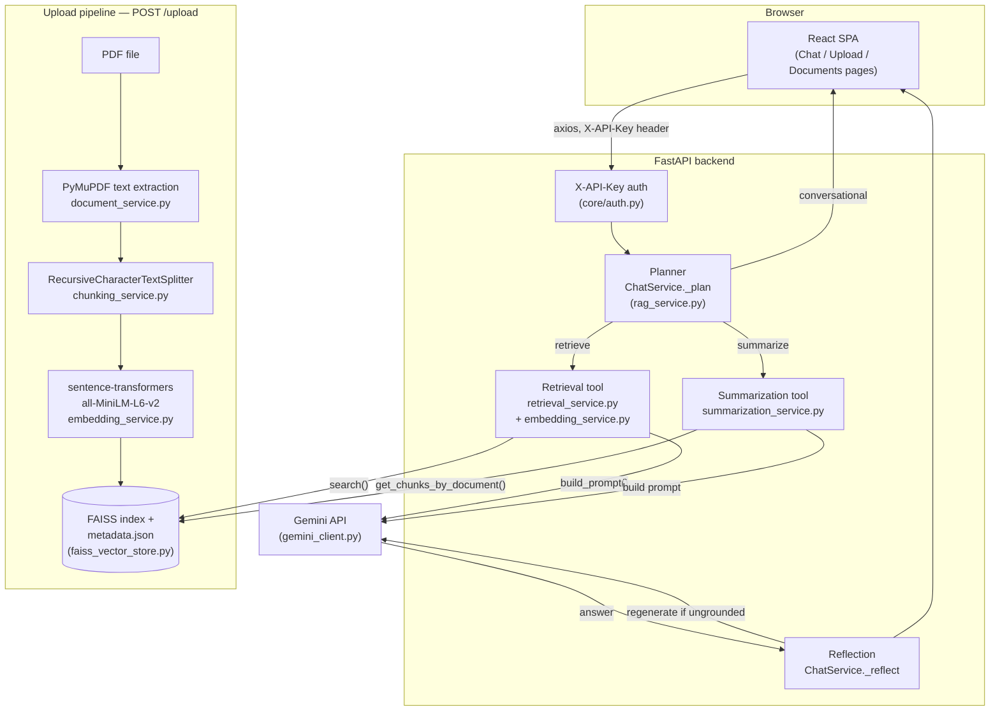

# Architecture

InsightAI-RAG is a document Q&A app: a React SPA, a FastAPI backend running
a small hand-rolled agent, a FAISS vector index, and Google Gemini for
generation. This document describes what's actually implemented — see
[`docs/NOT_APPLICABLE.md`](NOT_APPLICABLE.md) for what's deliberately out
of scope, and [`docs/DESIGN_REVIEW.md`](DESIGN_REVIEW.md) for the
reasoning behind specific choices.

## Diagram

## Components

**React frontend** (`frontend/src/`). A Vite + Tailwind SPA with five
routes (Home, Upload, Chat, Documents, Settings). `services/api.js` holds
a shared axios instance that attaches the `X-API-Key` header
(`VITE_API_KEY`) to every request. `hooks/useChat.js` owns chat state
client-side and sends the running conversation as `history` on each
`/chat` call; `services/documentService.js` tracks upload history in
`localStorage`, since the backend exposes no document-listing endpoint.

**Auth** (`app/core/auth.py`). A single FastAPI dependency,
`require_api_key`, checks the `X-API-Key` request header against
`Settings.api_key` and raises `UnauthorizedError` (401) on mismatch. It's
applied at the router level to the documents and chat routers (`/health`
stays open). This is a shared-secret gate on the API as a whole, not
per-user identity — see `docs/NOT_APPLICABLE.md` for what that doesn't
cover (JWT, RBAC).

**Planner** (`app/services/rag_service.py`, `ChatService._plan`). Pure
keyword/regex routing — no LLM call. It returns one of three actions:
`conversational` (small-talk phrases matched against a fixed list, no
tool or LLM involved at all), `summarize` (triggered by a
"summarize"/"summary" keyword *and* a document-id-shaped UUID found in
the query text — without both, it falls back to `retrieve`), or
`retrieve` (the default).

**Retrieval tool** (`app/services/retrieval_service.py` +
`embedding_service.py`). Embeds the query with the same
`all-MiniLM-L6-v2` model used at ingestion, searches the FAISS index for
the configured `top_k`, and drops results below `min_score`. Depends only
on the `VectorStore` interface, never a concrete backend.

**Summarization tool** (`app/services/summarization_service.py`). Given a
document_id, pulls every chunk stored for that document via
`VectorStore.get_chunks_by_document()` (ordered by `chunk_index`), joins
their text, and asks Gemini for a single summary. No chunking of the
summary input itself — for a very long document this means the entire
concatenated chunk text goes into one prompt.

**Reflection** (`ChatService._reflect`). After a `retrieve`-action
generation, if chunks were retrieved but the answer came back empty or
equal to the model's own fallback line, it regenerates once with an
explicit "you didn't use the context" instruction
(`REFLECTION_INSTRUCTION` in `prompt_builder.py`). This is the system's
only self-correction step — it doesn't run for `summarize` or
`conversational` actions, and it only fires once per request (no retry
loop).

**Prompt construction** (`app/services/prompt_builder.py`). Every
retrieved chunk is wrapped in `---BEGIN UNTRUSTED DOCUMENT EXCERPT---` /
`---END EXCERPT---` markers with an explicit instruction that content
inside them is data, not instructions — the system's prompt-injection
defense. Prompts are versioned (`PROMPT_VERSION = "v1"`), logged on every
generation call, and include up to the last 6 turns of conversation
history when present.

**LLM client** (`app/services/gemini_client.py`). Isolated wrapper around
the `google-genai` SDK — nothing else in the codebase imports it
directly. Retries up to 3 times with exponential backoff on
`LLMTimeoutError`/`LLMAPIError` only (via `tenacity`), and logs prompt/
completion/total token counts plus an estimated cost
(`Settings.cost_per_1k_tokens`) read from `response.usage_metadata` on
every successful generation.

**Vector store** (`app/services/faiss_vector_store.py`). A FAISS
`IndexFlatIP` (exact inner-product search over L2-normalized vectors,
i.e. cosine similarity) plus a JSON metadata file, positionally aligned
by row. It's a single index file (`backend/vector_store/index.faiss` +
`metadata.json`) shared by every document — there's no sharding,
namespacing, or per-tenant isolation. Deletes rebuild the index from kept
vectors rather than using a native remove (FAISS's flat index has none),
which is exact but means delete cost scales with total index size.

**Upload pipeline** (`POST /upload`, orchestrated by
`document_processing_service.py`). Validation (`validation_service.py`:
MIME type, size limit, PDF magic bytes) → save to disk
(`upload_service.py`, UUID filename) → text extraction (`document_service.py`,
PyMuPDF — reads embedded text only, **not OCR**; a scanned image-only PDF
extracts little or no text) → chunking (`chunking_service.py`,
`RecursiveCharacterTextSplitter`, configurable size/overlap) → embedding
(`embedding_service.py`) → indexing (`faiss_vector_store.py`). PII
detection (`pii_service.py`: regex for emails, phone numbers,
SSN/ID-like patterns) runs on the extracted text partway through this
pipeline and logs match counts — never raw values — without blocking
ingestion (flag-and-continue).

**Observability**. Structured JSON logs (`app/core/logging.py`) carry a
`request_id` (generated or propagated per request by middleware in
`main.py`, via a `contextvar`) on every line automatically. Domain errors
carry a `taxonomy_category` (`app/core/exceptions.py`) logged on failure.
`backend/eval/metrics_report.py` parses these logs into latency
percentiles, error rate by category, and token/cost totals — explicitly
a local stand-in for real observability (see its own docstring and
`docs/OPERATIONS.md`).

## Framework choice

The chat orchestration in `rag_service.py` is deliberately plain Python —
a `_plan` dispatcher, three action branches, one reflection step — not
LangGraph, CrewAI, or any agent framework. That's a fit-for-scale
decision, not an oversight:

- **Two tools, not a team.** Retrieval and summarization are the entire
  tool surface. Both operate on the same document corpus, the same FAISS
  index, and the same LLM — there's no genuinely distinct responsibility
  (different data source, different persona, different permission
  boundary) that would justify giving either its own agent. Multi-agent
  frameworks earn their complexity when responsibilities are actually
  separable and need to hand off partial work to each other; that's not
  this system.
- **Linear-with-branches, not a graph.** `_plan` picks exactly one of
  three branches per request; the `retrieve` branch itself is a straight
  line (retrieve → generate → reflect → maybe-regenerate-once) with no
  dynamic re-planning, no loops back through the planner, and no tool
  invoking another tool. A graph-orchestration runtime is built to manage
  cycles, conditional multi-hop routing, and shared long-lived state
  across nodes — none of which this control flow has.
  `ChatService.handle_query` is a single function with an `if/elif` and a
  `try/except`; that's an accurate description of the actual complexity,
  not a simplification of something bigger underneath.
- **Traceability stays simple.** One `ChatService`, one request_id, one
  log stream per request (see Observability above). Splitting this into
  cooperating agents would mean designing an inter-agent message
  protocol and correlating logs across it, for a system that today has
  exactly one LLM call in the common case and at most two (with
  reflection).
- **Testability.** `_plan` and `_reflect` are unit-tested directly
  (`backend/tests/test_rag_service.py`) as plain methods on a plain
  object, with fake `VectorStore`/`LLMClient` — no framework-specific test
  harness or mocked agent runtime required.

If a genuinely distinct responsibility shows up later — for example, a
document-ingestion agent with its own tools and failure modes, separate
from the question-answering agent — that would be the point to
reconsider. Two tools sharing one corpus and one model isn't it.
