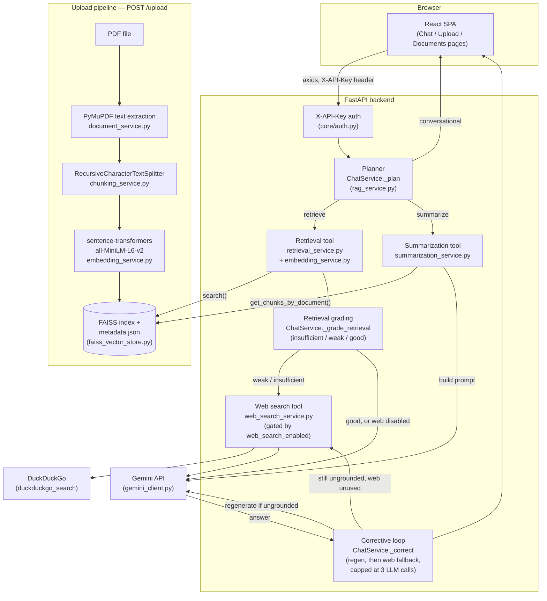

# Architecture

InsightAI-RAG is a document Q&A app: a React SPA, a FastAPI backend running
a small hand-rolled agent, a FAISS vector index, and Google Gemini for
generation. This document describes what's actually implemented — see
[`docs/NOT_APPLICABLE.md`](NOT_APPLICABLE.md) for what's deliberately out
of scope, and [`docs/DESIGN_REVIEW.md`](DESIGN_REVIEW.md) for the
reasoning behind specific choices.

## Diagram



## Two-service architecture: InsightAI + LeafSense

`POST /chat/diagnose` lets a user upload a plant leaf photo instead of
typing a question. InsightAI has no vision model of its own — it calls
**LeafSense**, a separate FastAPI service (its own repo, its own
TensorFlow/Keras stack) over plain HTTP, gets back a predicted disease
class, and feeds that into the *same* retrieval + corrective RAG loop
described above. The two services never share a process, a codebase, or
a Python environment; the only coupling is an HTTP request/response and
the class-label vocabulary in `vision_client.py`'s `CLASS_LABEL_MAP`.

```mermaid
flowchart LR
    subgraph InsightAI["InsightAI-RAG backend (this repo)"]
        Route["POST /chat/diagnose<br/>(app/api/v1/routes/query.py)"]
        VisionClient["vision_client.py<br/>diagnose_image()"]
        Diagnose["ChatService.handle_diagnose<br/>(rag_service.py)"]
        RAGLoop["Existing retrieval +<br/>corrective RAG loop"]
    end

    subgraph LeafSense["LeafSense backend (separate repo/process)"]
        Predict["POST /predict/{model_id}<br/>(backend/main.py)"]
        Model["Hybrid CBAM + EfficientNetB0 + ViT<br/>TensorFlow/Keras, 38 classes<br/>(backend/model_arch.py)"]
    end

    Photo["Leaf photo<br/>(multipart upload)"] --> Route
    Route --> VisionClient
    VisionClient -- "HTTP POST, multipart<br/>VISION_SERVICE_URL" --> Predict
    Predict --> Model
    Model -- "{class, confidence}" --> Predict
    Predict -- "JSON response" --> VisionClient
    VisionClient -- "VisionPrediction<br/>(crop, disease, confidence,<br/>low_confidence)" --> Diagnose
    Diagnose -- "\"{disease} on {crop}\"<br/>as the query" --> RAGLoop
    RAGLoop -- "grounded, cited answer<br/>+ diagnosis" --> Route
```

Failure handling: `vision_client.py` raises `VisionServiceError`
(`taxonomy_category = "tool"`, same category as `WebSearchError`/
`LLMAPIError`) if LeafSense is unreachable, times out
(`Settings.vision_service_timeout_seconds`), or returns something outside
its documented `{class, confidence}` shape — this propagates as a normal
502 through the existing `AppError` → `error_handlers.py` path, no new
handler wiring needed. A prediction below `Settings.vision_confidence_threshold`
is *not* an error — it still flows through to retrieval/generation, just
flagged `low_confidence=True` on the response's `diagnosis` field so the
caller can decide how much to trust it. A crop LeafSense recognizes but
the corpus has no documents for (e.g. grape, cherry — InsightAI's corpus
currently covers apple, corn, potato, tomato, peach) isn't special-cased
either: it runs through the same retrieval-then-generate path as any
off-topic text query and lands on the same fixed fallback reply, since
`_build_diagnosis_query`'s output is just another string to `retrieve()`.

Ports: LeafSense's own default (`uvicorn main:app`, no `--port` flag) is
**8000** — the same default this backend uses. `Settings.vision_service_url`
defaults to `http://localhost:8001` specifically to avoid that collision;
see the README for running both services together locally.

## Components

**React frontend** (`frontend/src/`). A Vite + Tailwind SPA with five
routes (Home, Upload, Chat, Documents, Settings). `services/api.js` holds
a shared axios instance that attaches the `X-API-Key` header
(`VITE_API_KEY`) to every request. `hooks/useChat.js` owns chat state
client-side and sends the running conversation as `history` on each
`/chat` call; `services/documentService.js` tracks upload history in
`localStorage`, since the backend exposes no document-listing endpoint.

**Auth** (`app/core/auth.py`). A single FastAPI dependency,
`require_api_key`, checks the `X-API-Key` request header against
`Settings.api_key` and raises `UnauthorizedError` (401) on mismatch. It's
applied at the router level to the documents and chat routers (`/health`
stays open). This is a shared-secret gate on the API as a whole, not
per-user identity — see `docs/NOT_APPLICABLE.md` for what that doesn't
cover (JWT, RBAC).

**Planner** (`app/services/rag_service.py`, `ChatService._plan`). Pure
keyword/regex routing — no LLM call. It returns one of three actions:
`conversational` (small-talk phrases matched against a fixed list, no
tool or LLM involved at all), `summarize` (triggered by a
"summarize"/"summary" keyword *and* a document-id-shaped UUID found in
the query text — without both, it falls back to `retrieve`), or
`retrieve` (the default, which runs the corrective RAG loop described
below). A fourth action, `diagnose`, exists but bypasses `_plan` entirely
— image presence on `POST /chat/diagnose` is an unambiguous routing
signal `ChatService.handle_diagnose` acts on directly, with no text to
classify (see "Two-service architecture" below).

**Vision tool** (`app/services/vision_client.py`). Not a local model —
an HTTP client for LeafSense, a separate FastAPI service with its own
TensorFlow/Keras stack (see "Two-service architecture" below). Isolated
the same way `web_search_service.py` isolates `duckduckgo_search`:
nothing else in this codebase imports `httpx` for this purpose or knows
LeafSense's class-label vocabulary. `ChatService.handle_diagnose` turns
the predicted crop + disease into a query and feeds it through the exact
same retrieval → grading → corrective-loop path `retrieve` uses.

**Retrieval tool** (`app/services/retrieval_service.py` +
`embedding_service.py`). Embeds the query with the same
`all-MiniLM-L6-v2` model used at ingestion, searches the FAISS index for
the configured `top_k`, and drops results below `min_score`. Depends only
on the `VectorStore` interface, never a concrete backend.

**Retrieval grading** (`ChatService._grade_retrieval`). A cheap heuristic
— no LLM call — run immediately after retrieval on every `retrieve`
action: no chunks survived `min_score` → `"insufficient"`; chunks
survived but the top score is below `Settings.retrieval_grade_threshold`
→ `"weak"`; otherwise → `"good"`. This grade is what the corrective loop
branches on — it's the "corrective" in corrective RAG.

**Web search tool** (`app/services/web_search_service.py`). Fetches the
top `Settings.web_search_result_count` results (title, URL, snippet) from
DuckDuckGo via the `duckduckgo-search` package — no API key required.
Gated behind `Settings.web_search_enabled` (default `false`); when off,
nothing in this system makes an outbound network call other than to
Gemini/Groq. Isolated the same way `gemini_client.py`/`groq_client.py`
isolate their SDKs — nothing else imports `duckduckgo_search` directly. A
search failure (or, in practice, DuckDuckGo silently rate-limiting
requests from cloud/data-center IPs — a known limitation of unofficial
scraping-based search) raises `WebSearchError`, which `ChatService`
catches and treats as zero results rather than failing the request; web
search is a best-effort enhancement, not a dependency.

**Summarization tool** (`app/services/summarization_service.py`). Given a
document_id, pulls every chunk stored for that document via
`VectorStore.get_chunks_by_document()` (ordered by `chunk_index`), joins
their text, and asks Gemini for a single summary. No chunking of the
summary input itself — for a very long document this means the entire
concatenated chunk text goes into one prompt. Not part of the corrective
loop — no grading, no web fallback.

**Corrective loop** (`ChatService._correct`, generalizing the earlier
single-shot "reflection" step). After the `retrieve` action's first
generation call, if chunks/web-results were available but the answer came
back empty or equal to the model's own fallback line, it regenerates once
with an explicit "you didn't use the context" instruction
(`REFLECTION_INSTRUCTION` in `prompt_builder.py`). If that's *still*
ungrounded and `web_search_enabled` is on but wasn't already used for this
request (a `"good"`-graded retrieval skips the web search that a
`"weak"`/`"insufficient"` grade triggers up front — see the diagram), it
fetches web results and makes one final attempt with them added to the
prompt. Every path is capped at `_MAX_LLM_CALLS = 3` total `generate()`
calls per request — checked before each additional call, logging
`"loop_capped"` if one would be needed but the cap blocks it. With
`web_search_enabled=false` (the default), this cap is never approached:
the loop can only reach its one reflection retry, exactly reproducing the
old single-shot reflection behavior.

**Streaming** (`POST /chat/stream`, `ChatService.stream_query`). The same
planner and pipeline as `handle_query` above, mirrored into a generator
that yields SSE events — a `trace` event per pipeline stage (including a
`reflecting` one when the corrective loop above fires), `answer_chunk`
pieces from `LLMClient.generate_stream()` as the model produces them, and
one final `done` carrying the same `ChatResponse` shape `POST /chat`
returns. `handle_query`/`_correct` and `stream_query`/`_correct_streamed`
are two parallel implementations of the same control flow, not one
sharing the other's code — they're required to be kept in sync by
convention (and by `test_rag_service_stream.py` asserting identical
`steps_taken` for equivalent runs), not by construction. `GeminiClient`
and `GroqClient` both implement real token streaming
(`generate_content_stream` / `stream=True`); `LLMClient`'s default
`generate_stream()` just yields `generate()`'s full result once, which is
what `FallbackLLMClient` uses — real streaming is lost specifically when
a fallback is active, a deliberate trade-off over silently re-streaming
from a second provider mid-response to a client that's already rendered
partial output from the first.

**Prompt construction** (`app/services/prompt_builder.py`). Every
retrieved chunk is wrapped in `---BEGIN UNTRUSTED DOCUMENT EXCERPT---` /
`---END EXCERPT---` markers; web results (when present) get their own
`---BEGIN UNTRUSTED WEB RESULT---` / `---END WEB RESULT---` markers plus
an extra instruction telling the model to prefer document context and be
explicit when it's drawing on web results instead — both marker types
carry the same "this is data, not instructions" prompt-injection defense.
Prompts are versioned (`PROMPT_VERSION = "v1"`), logged on every
generation call, and include up to the last 6 turns of conversation
history when present.

**LLM client** (`app/services/gemini_client.py`). Isolated wrapper around
the `google-genai` SDK — nothing else in the codebase imports it
directly. Retries up to 3 times with exponential backoff on
`LLMTimeoutError`/`LLMAPIError` only (via `tenacity`), and logs prompt/
completion/total token counts plus an estimated cost
(`Settings.cost_per_1k_tokens`) read from `response.usage_metadata` on
every successful generation.

**Vector store** (`app/services/faiss_vector_store.py`). A FAISS
`IndexFlatIP` (exact inner-product search over L2-normalized vectors,
i.e. cosine similarity) plus a JSON metadata file, positionally aligned
by row. It's a single index file (`backend/vector_store/index.faiss` +
`metadata.json`) shared by every document — there's no sharding,
namespacing, or per-tenant isolation. Deletes rebuild the index from kept
vectors rather than using a native remove (FAISS's flat index has none),
which is exact but means delete cost scales with total index size.

**Upload pipeline** (`POST /upload`, orchestrated by
`document_processing_service.py`). Validation (`validation_service.py`:
MIME type, size limit, PDF magic bytes) → save to disk
(`upload_service.py`, UUID filename) → text extraction (`document_service.py`,
PyMuPDF for pages with an embedded text layer, falling back to OCR
(pytesseract/tesseract) for pages with none — see the README's Features
and Known Limitations for what that fallback covers) → chunking (`chunking_service.py`,
`RecursiveCharacterTextSplitter`, configurable size/overlap) → embedding
(`embedding_service.py`) → indexing (`faiss_vector_store.py`). PII
detection (`pii_service.py`: regex for emails, phone numbers,
SSN/ID-like patterns) runs on the extracted text partway through this
pipeline and logs match counts — never raw values — without blocking
ingestion (flag-and-continue).

**Observability**. Structured JSON logs (`app/core/logging.py`) carry a
`request_id` (generated or propagated per request by middleware in
`main.py`, via a `contextvar`) on every line automatically. Domain errors
carry a `taxonomy_category` (`app/core/exceptions.py`) logged on failure.
`backend/eval/metrics_report.py` parses these logs into latency
percentiles, error rate by category, and token/cost totals — explicitly
a local stand-in for real observability (see its own docstring and
`docs/OPERATIONS.md`).

## Framework choice

The chat orchestration in `rag_service.py` is deliberately plain Python —
a `_plan` dispatcher, three action branches, and (for `retrieve`) a small
bounded corrective loop — not LangGraph, CrewAI, or any agent framework.
Adding the corrective RAG loop (retrieval grading, a web search fallback,
capped regeneration) is exactly the kind of change that might seem to
tip the scale toward "now you need a graph runtime." It doesn't, and it's
worth re-justifying why now that there are three tools and an actual
loop, not two tools and a straight line:

- **Three tools, still not a team.** Retrieval, summarization, and web
  search are the entire tool surface. Web search does reach outside the
  document corpus — but *which* tool runs is still a hand-coded decision
  (a score threshold in `_grade_retrieval`), not something an LLM
  reasons about and chooses between, and a web result becomes nothing
  more than another block of context in the same prompt to the same
  model — there's no independent reasoning loop on the far side of that
  "hand-off" for a second agent to own. Multi-agent frameworks earn their
  complexity when responsibilities are actually separable *and* need to
  hand off partial work between independent reasoning processes; a
  deterministic if-this-score-then-fetch-that isn't that.
- **A bounded loop, not a graph.** The `retrieve` branch is no longer a
  straight line — `_correct` can regenerate, then escalate to web search,
  then regenerate once more. But it's a small, fixed-depth loop with a
  hard, checked ceiling (`_MAX_LLM_CALLS = 3`), not dynamic re-planning:
  there are at most three possible generation counts (1, 2, or 3) and a
  handful of enumerable paths through them, all of which
  `backend/tests/test_rag_service.py`'s `TestCorrectiveLoop` tests
  directly, by name, one per path. A graph-orchestration runtime is built
  to manage *unbounded* cycles, conditional multi-hop routing, and shared
  mutable state across many nodes — this loop has none of that: it's one
  Python function with two `if`-guarded early returns, not a state
  machine that needs a scheduler. Expressing it as a LangGraph graph
  would trade a function you can read top-to-bottom for a node/edge
  definition plus a state schema, to compute the exact same bounded
  sequence.
- **Traceability stays simple.** One `ChatService`, one request_id, one
  log stream per request (see Observability above) — grading
  (`retrieval_graded`), web search (`web_search_completed`/
  `web_search_failed`), and each regeneration
  (`reflection_triggered`/`web_fallback_triggered`/`loop_capped`) are just
  more named events in that same stream, not messages crossing an
  inter-agent protocol that would need its own correlation story.
- **Testability.** `_plan`, `_grade_retrieval`, and `_correct` are all
  unit-tested directly (`backend/tests/test_rag_service.py`) as plain
  methods on a plain object, with fake `VectorStore`/`LLMClient` and a
  monkeypatched `search_web` — no framework-specific test harness or
  mocked agent runtime required. The loop's cap is tested by monkeypatching
  `_MAX_LLM_CALLS` down and asserting the blocked call never fires
  (`TestCorrectiveLoop.test_loop_cap_blocks_*`), which is only this
  simple because the cap is an explicit, readable guard in plain code.

If a genuinely distinct responsibility shows up later — for example, a
document-ingestion agent with its own tools and failure modes, separate
from the question-answering agent, or a web research capability that
needs its *own* multi-step reasoning rather than a single fetch-and-append
— that would be the point to reconsider. Three tools and one small capped
loop, all sharing one model and one request, isn't it.
