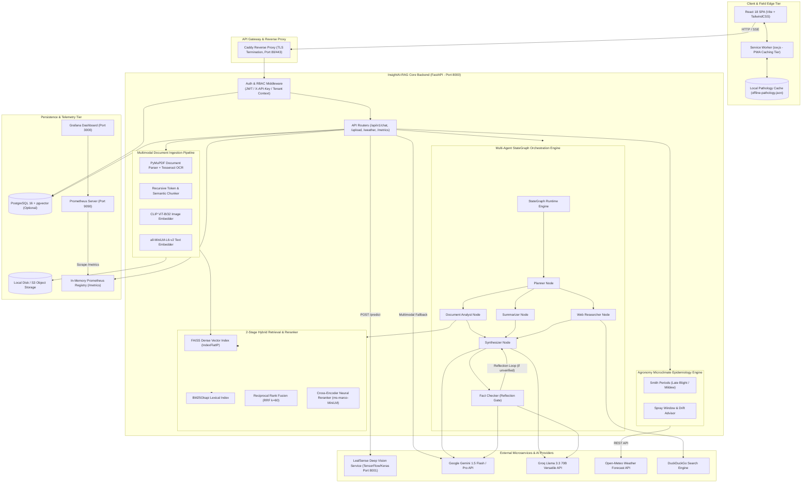
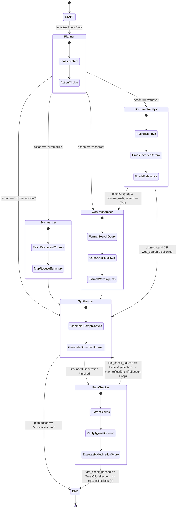
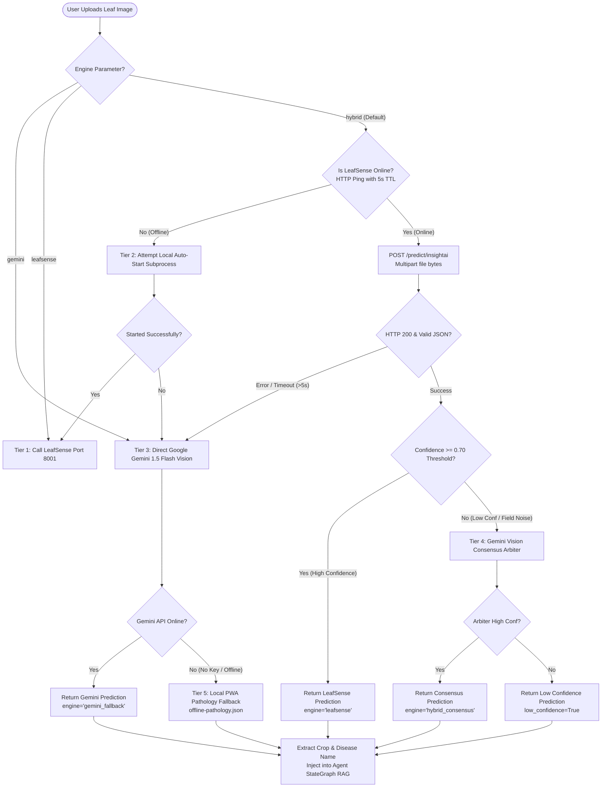
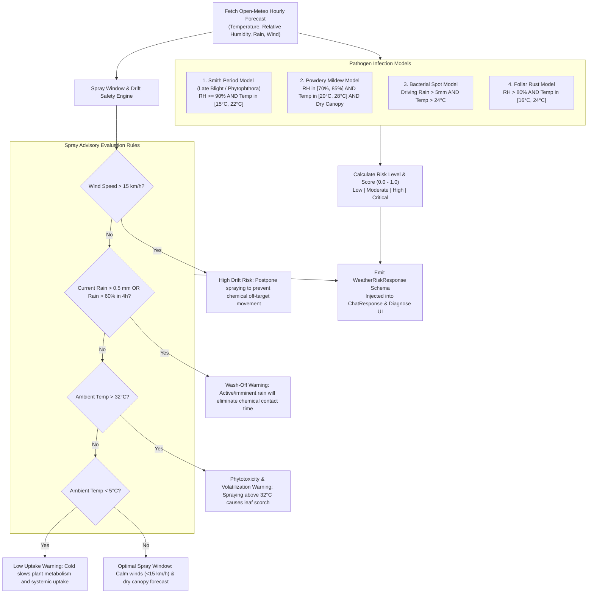
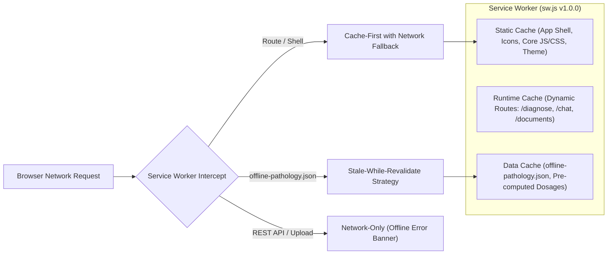
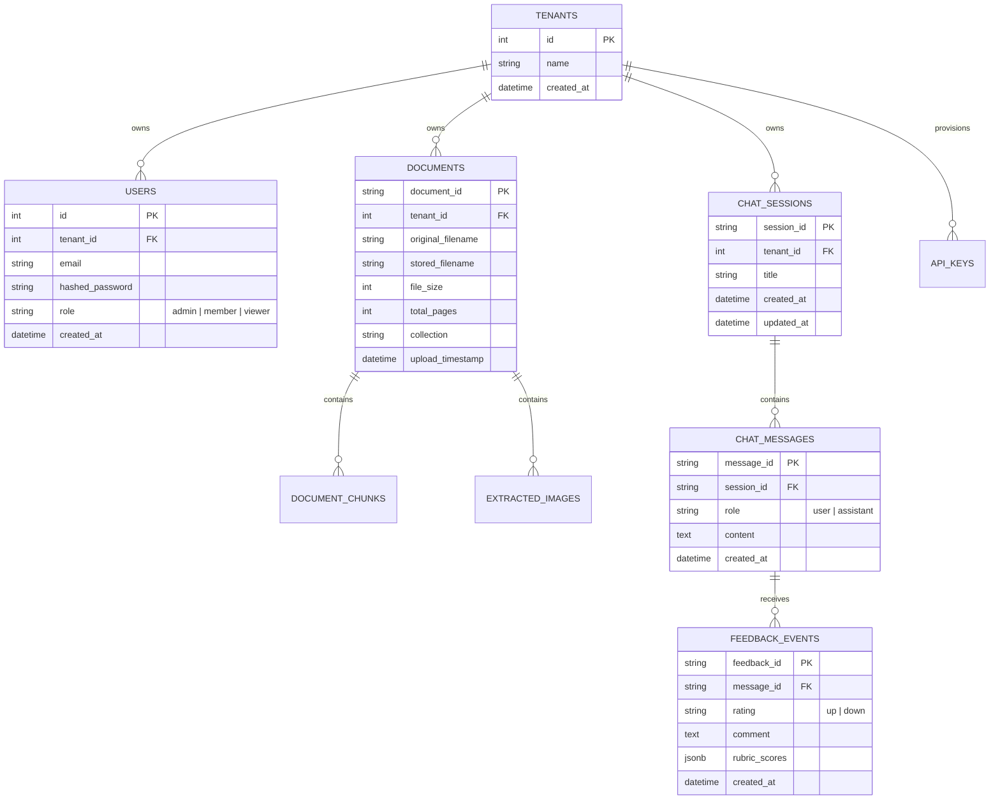

# InsightAI-RAG Architecture Blueprint & System Overview

Welcome to the comprehensive technical architecture specification for **InsightAI-RAG**, an enterprise-grade, multimodal Retrieval-Augmented Generation (RAG) and agronomic pathology intelligence platform. InsightAI-RAG couples state-of-the-art multi-agent workflow orchestration, dual-stage hybrid retrieval, deep convolutional vision diagnostics, real-time microclimate epidemiology modeling, and offline-first edge resilience.

---

## Table of Contents

1. [High-Level System Architecture](#1-high-level-system-architecture)
2. [Multi-Agent StateGraph Runtime](#2-multi-agent-stategraph-runtime)
3. [LeafSense Deep CNN Vision & Cascaded Multimodal Fallback](#3-leafsense-deep-cnn-vision--cascaded-multimodal-fallback)
4. [2-Stage Retrieval Engine (Hybrid RRF + Cross-Encoder)](#4-2-stage-retrieval-engine-hybrid-rrf--cross-encoder)
5. [Microclimate Epidemiological Engine (Open-Meteo Smith Periods)](#5-microclimate-epidemiological-engine-open-meteo-smith-periods)
6. [PWA Offline Service Worker & Local Pathology Fallback](#6-pwa-offline-service-worker--local-pathology-fallback)
7. [Prometheus Observability, Metrics & Telemetry](#7-prometheus-observability-metrics--telemetry)
8. [Data Models, Storage & Tenant Isolation](#8-data-models-storage--tenant-isolation)
9. [Component Cross-Reference Index](#9-component-cross-reference-index)

---

## 1. High-Level System Architecture

InsightAI-RAG is organized as a decoupled, microservices-oriented distributed architecture. The system exposes both synchronous REST and streaming Server-Sent Events (SSE) APIs, backed by an asynchronous background worker subsystem, dedicated vector and lexical search indexes, a relational metadata catalog, and external agro-meteorological feeds.

### 1.1 Architecture Topology Diagram



---

## 2. Multi-Agent StateGraph Runtime

The orchestration engine powering InsightAI-RAG is a pure-Python, graph-based agent runtime located in [`backend/app/services/agent_graph/`](file:///backend/app/services/agent_graph/). Inspired by modern computation graph architectures, it replaces fragile prompt-chaining with a deterministic, typed state-machine featuring state snapshots, conditional branching, cycle capping, and self-corrective reflection loops.

### 2.1 StateGraph Architecture & Workflow Diagram



### 2.2 Agent Nodes & Responsibilities

| Node Name | Source Reference | Function Signature | Primary Responsibility |
| :--- | :--- | :--- | :--- |
| **`planner`** | [`planner_node`](file:///backend/app/services/agent_graph/nodes.py#L35) | `async def planner_node(state: AgentState, context: GraphContext) -> dict[str, Any]` | Analyzes user query, session history, and available tool permissions to emit an execution plan (`action`: `retrieve`, `summarize`, `research`, or `conversational`). |
| **`document_analyst`** | [`document_analyst_node`](file:///backend/app/services/agent_graph/nodes.py#L82) | `async def document_analyst_node(state: AgentState, context: GraphContext) -> dict[str, Any]` | Executes 2-stage hybrid search (dense FAISS + sparse BM25 + Cross-Encoder reranker). Assesses retrieval confidence (`good`, `weak`, `insufficient`). |
| **`summarizer`** | [`summarizer_node`](file:///backend/app/services/agent_graph/nodes.py#L136) | `async def summarizer_node(state: AgentState, context: GraphContext) -> dict[str, Any]` | Collects all chunks associated with a specific `document_id` and executes multi-chunk MapReduce or iterative summarization. |
| **`web_researcher`** | [`web_researcher_node`](file:///backend/app/services/agent_graph/nodes.py#L168) | `async def web_researcher_node(state: AgentState, context: GraphContext) -> dict[str, Any]` | Executes external queries via DuckDuckGo, formatting real-time web citations with explicit domain tracking. |
| **`synthesizer`** | [`synthesizer_node`](file:///backend/app/services/agent_graph/nodes.py#L205) | `async def synthesizer_node(state: AgentState, context: GraphContext) -> dict[str, Any]` | Synthesizes strict, evidence-grounded answers with numeric bracket citations (`[1]`, `[2]`), integrating diagnostic & microclimate contexts when available. |
| **`fact_checker`** | [`fact_checker_node`](file:///backend/app/services/agent_graph/nodes.py#L254) | `async def fact_checker_node(state: AgentState, context: GraphContext) -> dict[str, Any]` | Verifies factual claims against retrieved chunks. Computes lexical and semantic grounding scores. Triggers self-correction reflection if score falls below threshold. |

### 2.3 State Checkpointing & Loop Safety Guardrails

The engine guarantees fault-tolerant execution and prevents infinite recursion via strict guardrails:
1. **Loop Cycle Cap (`max_steps=10`)**: The [`CompiledGraph`](file:///backend/app/services/agent_graph/engine.py#L110) tracks total node executions. If `step_count >= max_steps`, execution halts immediately with [`MaxStepsExceededError`](file:///backend/app/services/agent_graph/engine.py#L39), gracefully yielding the best partial state.
2. **Reflection Cap (`max_reflections=2`)**: Self-correction reflection loops between `fact_checker` and `synthesizer` are limited to 2 iterations.
3. **Immutable Step Snapshots**: Every step appends a [`StateSnapshot`](file:///backend/app/services/agent_graph/engine.py#L44) recording `step_index`, `node_name`, timestamp, execution duration in milliseconds, and deep-copied state diffs for audit trails.

---

## 3. LeafSense Deep CNN Vision & Cascaded Multimodal Fallback

InsightAI-RAG features plant leaf pathology vision capabilities. Vision diagnostics are managed through a cascaded, resilient multi-tier fallback architecture implemented in [`vision_client.py`](file:///backend/app/services/vision_client.py) and [`vision_qa_service.py`](file:///backend/app/services/vision_qa_service.py).

### 3.1 LeafSense Deep CNN Architecture

The dedicated vision microservice (**LeafSense**, port 8001) runs a custom hybrid deep neural network:
- **Base Feature Extractor**: EfficientNet-B4 pre-trained on ImageNet with fine-tuned top layers.
- **Attention Mechanism**: Convolutional Block Attention Module (CBAM) providing dual-channel and spatial attention over localized leaf lesions.
- **Transformer Encoder**: Vision Transformer (ViT) patch embedding blocks capturing long-range contextual spatial dependencies across the leaf canopy.
- **Classification Head**: Dense 512-d projection with Swish activation, Dropout (0.4), and Softmax output across **38 PlantVillage disease and healthy classes**.
- **Validated Accuracy**: **98.24% top-1 validation accuracy** evaluated on 54,305 benchmark images.

### 3.2 Cascaded Vision Fallback Sequence



### 3.3 38 Plant Pathology Disease Taxonomy Mapping

[`CLASS_LABEL_MAP`](file:///backend/app/services/vision_client.py#L70) normalizes raw CNN classification strings into structured crop and disease pairs:

| Crop Family | Target Disease / State | Normalized Pathogen / Scientific Name |
| :--- | :--- | :--- |
| **Apple** | Apple Scab, Black Rot, Cedar Apple Rust, Healthy | *Venturia inaequalis*, *Botryosphaeria obtusa*, *Gymnosporangium juniperi-virginianae* |
| **Blueberry** | Healthy | *Vaccinium corymbosum* |
| **Cherry** | Powdery Mildew, Healthy | *Podosphaera clandestina* |
| **Corn (Maize)**| Cercospora Leaf Spot (Gray Leaf Spot), Common Rust, Northern Leaf Blight, Healthy | *Cercospora zeae-maydis*, *Puccinia sorghi*, *Exserohilum turcicum* |
| **Grape** | Black Rot, Esca (Black Measles), Leaf Blight (Isariopsis), Healthy | *Guignardia bidwellii*, *Fomitiporia mediterranea*, *Pseudocercospora cladosporioides* |
| **Orange** | Huanglongbing (Citrus Greening) | *Candidatus Liberibacter asiaticus* (Vector: *Diaphorina citri*) |
| **Peach** | Bacterial Spot, Healthy | *Xanthomonas arboricola pv. pruni* |
| **Pepper (Bell)**| Bacterial Spot, Healthy | *Xanthomonas campestris pv. vesicatoria* |
| **Potato** | Early Blight, Late Blight, Healthy | *Alternaria solani*, *Phytophthora infestans* |
| **Raspberry** | Healthy | *Rubus idaeus* |
| **Soybean** | Healthy | *Glycine max* |
| **Squash** | Powdery Mildew | *Podosphaera xanthii* |
| **Strawberry** | Leaf Scorch, Healthy | *Diplocarpon earlianum* |
| **Tomato** | Bacterial Spot, Early Blight, Late Blight, Leaf Mold, Septoria Leaf Spot, Two-Spotted Spider Mite, Target Spot, Yellow Leaf Curl Virus (TYLCV), Mosaic Virus, Healthy | *Xanthomonas spp.*, *Alternaria solani*, *Phytophthora infestans*, *Passalora fulva*, *Septoria lycopersici*, *Tetranychus urticae*, *Corynespora casiicola*, *Begomovirus* |

---

## 4. 2-Stage Retrieval Engine (Hybrid RRF + Cross-Encoder)

InsightAI-RAG employs a 2-stage retrieval pipeline combining dense semantic vector search, sparse lexical BM25 retrieval, and neural cross-attention reranking.

```
Query: "What fungicides treat Alternaria solani on tomatoes?"
  │
  ├─── Stage 1A: Dense Semantic Search (all-MiniLM-L6-v2, 384-d FAISS FlatIP) ───> Top-20 Candidates
  ├─── Stage 1B: Sparse Lexical Search (BM25Okapi Token Index) ────────────────────> Top-20 Candidates
  ├─── Stage 1C: Cross-Modal Visual Search (CLIP ViT-B/32 Image Vectors) ──────────> Top-20 Candidates
  │
  ▼
Stage 1 Fusion: Reciprocal Rank Fusion (RRF k=60)
  RRF(d) = Σ [ w_m / (60 + rank_m(d)) ] ───────────────────────────────────────────> Top-10 Fused Chunks
  │
  ▼
Stage 2: Neural Cross-Encoder Reranking (ms-marco-MiniLM-L-6-v2)
  Score(q, d) = CrossAttentionSoftmax( [CLS] Query [SEP] Chunk [SEP] ) ────────────> Top-5 Final Chunks
```

### 4.1 Stage 1: Reciprocal Rank Fusion (RRF) Formulation

Candidate chunks retrieved from the independent dense, sparse, and visual indexes are merged using Reciprocal Rank Fusion (RRF) with smoothing constant $k = 60$:

$$RRF(d) = \sum_{m \in M} \frac{w_m}{k + \text{rank}_m(d)}$$

Where:
- $M = \{\text{semantic}, \text{bm25}, \text{clip}\}$ represents the active retrieval modalities.
- $\text{rank}_m(d) \in \{1, 2, \dots, K\}$ is the 1-based ordinal rank of document chunk $d$ in retriever $m$.
- $k = 60$ is the standard RRF smoothing parameter preventing high-ranking outliers from dominating.
- $w_m$ is the modality weight configured in [`Settings`](file:///backend/app/core/config.py):
  - **Two-Signal Mode (Default)**: $w_{\text{semantic}} = 0.60$, $w_{\text{bm25}} = 0.40$.
  - **Three-Signal Multi-Modal Mode**: $w_{\text{clip}} = 0.20$, $w_{\text{semantic}} = 0.48$, $w_{\text{bm25}} = 0.32$.

### 4.2 Stage 2: Cross-Encoder Neural Reranking

While Stage 1 bi-encoders evaluate query and document embeddings independently via inner products ($\mathbf{u} \cdot \mathbf{v}$), the Stage 2 Cross-Encoder ([`CrossEncoderReranker`](file:///backend/app/services/reranker.py)) feeds the concatenated sequence into all transformer layers:

$$\text{Input} = [\text{CLS}] \circ \text{Query} \circ [\text{SEP}] \circ \text{Chunk Text} \circ [\text{SEP}]$$

$$\text{RerankScore}(q, d) = \sigma\left(\mathbf{W} \cdot \text{Transformer}(\text{Input})_{[\text{CLS}]}\right)$$

This full cross-attention mechanism captures deep semantic interactions, resolving chemical synonyms, active ingredient dosages, and negative contraindications with high precision.

---

## 5. Microclimate Epidemiological Engine (Open-Meteo Smith Periods)

The microclimate intelligence service ([`weather_service.py`](file:///backend/app/services/weather_service.py)) integrates real-time hourly meteorological data from the Open-Meteo API to calculate disease pathogen infection pressure and generate chemical spray advisories.

### 5.1 Epidemiological Risk Models



### 5.2 Smith Period Calculation Logic

Late Blight (*Phytophthora infestans*) and Downy Mildew outbreaks require sustained moisture and moderate temperatures for zoospore germination. The Smith Period is defined as:
- **Criteria**: $\ge 10$ consecutive hourly intervals where $\text{Relative Humidity} \ge 90\%$ and $15^\circ\text{C} \le \text{Temperature} \le 22^\circ\text{C}$.
- **Scoring**:
  - $\ge 14\text{ hours}$: **Critical Risk** ($\text{Risk Score} \ge 0.91$).
  - $10-13\text{ hours}$: **High Risk** ($\text{Risk Score} \ge 0.85$).
  - $6-9\text{ hours}$: **Moderate Risk** ($\text{Risk Score} \in [0.55, 0.70]$).
  - $< 6\text{ hours}$: **Low Risk** ($\text{Risk Score} = 0.10$).

---

## 6. PWA Offline Service Worker & Local Pathology Fallback

To support rural farm fields, orchards, and remote agricultural zones with intermittent or zero cellular connectivity, InsightAI-RAG implements a Progressive Web App (PWA) offline architecture.

### 6.1 Multi-Tier Caching Topology

Implemented in [`frontend/public/sw.js`](file:///frontend/public/sw.js), the service worker maintains three isolated cache partitions:



### 6.2 Offline Field Resilience Lifecycle

1. **Pre-caching on Install**: During service worker installation, [`PRECACHE_ASSETS`](file:///frontend/public/sw.js#L17) fetches the application shell, iconography, and the complete offline pathology knowledge base ([`offline-pathology.json`](file:///frontend/public/data/offline-pathology.json)).
2. **Connectivity Event Handling**: The [`OfflineBanner`](file:///frontend/src/components/ui/OfflineBanner.jsx) React component listens to `window.addEventListener('online')` and `window.addEventListener('offline')`.
3. **Local Pathology & Dosage Calculator**: When disconnected, the frontend automatically switches from server-side RAG to client-side local lookup:
   - Evaluates chemical dosage formulas locally (e.g. Copper hydroxide $2.5\text{g/L}$, Chlorothalonil $75\%\text{ WP}$ at $2.0\text{kg/ha}$).
   - Renders disease identification symptom guides and organic bio-control protocols directly from IndexedDB / service worker memory.

---

## 7. Prometheus Observability, Metrics & Telemetry

InsightAI-RAG includes a zero-dependency, in-process metrics registry and Prometheus text exposition exporter (`GET /metrics`).

### 7.1 Telemetry Pipeline

```mermaid
flowchart LR
    subgraph FastAPIApp["FastAPI Backend Process"]
        HTTPReq["HTTP Request"] --> MetricMid["metrics_middleware (main.py)"]
        MetricMid --> CoreReg["In-Process Core Metrics Registry (core/metrics.py)"]
        
        RAGService["RAG & Agent Operations"] --> RAGReg["RAG Metrics Service (services/metrics.py)"]
        
        GETMetrics["GET /metrics Route"] --> ExportProm["export_prometheus_metrics()"]
        CoreReg & RAGReg --> ExportProm
    end

    PromServer["Prometheus Server (Port 9090)"] -- "Scrape every 15s<br/>(Bearer Token Auth)" --> GETMetrics
    AlertManager["Prometheus Alertmanager (Port 9093)"] <-- "Alert Evaluations" -- PromServer
    Grafana["Grafana Telemetry Dashboard (Port 3000)"] -- "PromQL Queries" --> PromServer
```

### 7.2 Core Prometheus Metric Catalog

| Metric Name | Type | Description & Labels |
| :--- | :--- | :--- |
| `http_requests_total` | Counter | Total HTTP requests handled, labeled by `method`, `path`, and `status_code`. |
| `http_request_duration_seconds` | Histogram | Request latency histogram across 11 standard buckets ($0.005\text{s}$ to $10.0\text{s}$). |
| `insightai_rag_requests_total` | Counter | Total RAG queries processed, labeled by `endpoint` and `status` (`success`, `error`). |
| `insightai_rag_latency_seconds` | Histogram | Latency of RAG query pipelines and LLM inference. |
| `insightai_retrieval_latency_seconds` | Histogram | Stage 1 and Stage 2 retrieval durations. |
| `insightai_retrieved_chunks_count` | Histogram | Number of chunks surviving score floors per query. |
| `insightai_hallucinations_detected_total` | Counter | Total groundedness check failures flagged. |
| `insightai_tool_invocations_total` | Counter | Agent tool executions, labeled by `tool` (`retrieval`, `diagnose`, `web_search`, `summarize`). |
| `insightai_llm_tokens_total` | Counter | Cumulative LLM prompt and completion tokens, labeled by `model` and `token_type`. |
| `insightai_llm_cost_dollars` | Counter | Estimated API expenditure, labeled by `model`. |
| `insightai_total_vectors` | Gauge | Total active embeddings stored in the vector store. |

---

## 8. Data Models, Storage & Tenant Isolation

InsightAI-RAG supports both single-user file-backed deployments and enterprise multi-tenant PostgreSQL configurations.

### 8.1 Entity Relationship Diagram



### 8.2 Strict Tenant Isolation Guarantees

1. **Vector Store Filtering**: In FAISS, chunk records store `tenant_id` in metadata. Search filters candidate arrays prior to top-$k$ truncation, preventing cross-tenant leakage.
2. **PostgreSQL Row-Level Scoping**: When database persistence is enabled (`DATABASE_URL`), all document metadata, chat turns, and ingestion tasks enforce `WHERE tenant_id = :current_tenant`.

---

## 9. Component Cross-Reference Index

| Architectural Subsystem | Primary Python / JS Files | Key Classes / Functions |
| :--- | :--- | :--- |
| **Agent StateGraph Runtime** | [`backend/app/services/agent_graph/`](file:///backend/app/services/agent_graph/) | `StateGraph`, `CompiledGraph`, `AgentState`, `create_rag_agent_graph`, `planner_node`, `fact_checker_node` |
| **Vision Diagnostics** | [`backend/app/services/vision_client.py`](file:///backend/app/services/vision_client.py) | `diagnose_image`, `_diagnose_with_gemini_fallback`, `CLASS_LABEL_MAP` |
| **Hybrid Search & RRF** | [`backend/app/services/hybrid_search.py`](file:///backend/app/services/hybrid_search.py) | `hybrid_search`, `reciprocal_rank_fusion`, `BM25Index` |
| **Neural Reranker** | [`backend/app/services/reranker.py`](file:///backend/app/services/reranker.py) | `CrossEncoderReranker`, `get_cross_encoder_reranker` |
| **Microclimate Engine** | [`backend/app/services/weather_service.py`](file:///backend/app/services/weather_service.py) | `WeatherService`, `calculate_disease_risk`, `generate_spray_advisory` |
| **PWA Service Worker** | [`frontend/public/sw.js`](file:///frontend/public/sw.js) | Service worker install, activate, and multi-cache fetch listeners |
| **Offline Banner & UI** | [`frontend/src/components/ui/OfflineBanner.jsx`](file:///frontend/src/components/ui/OfflineBanner.jsx) | `OfflineBanner`, network event listeners |
| **Metrics & Observability** | [`backend/app/core/metrics.py`](file:///backend/app/core/metrics.py), [`backend/app/services/metrics.py`](file:///backend/app/services/metrics.py) | `CoreMetricsRegistry`, `export_prometheus_metrics`, `RequestTimer` |
| **API Route Controllers** | [`backend/app/api/v1/routes/`](file:///backend/app/api/v1/routes/) | `query.py`, `documents.py`, `health.py`, `metrics.py`, `auth.py` |
