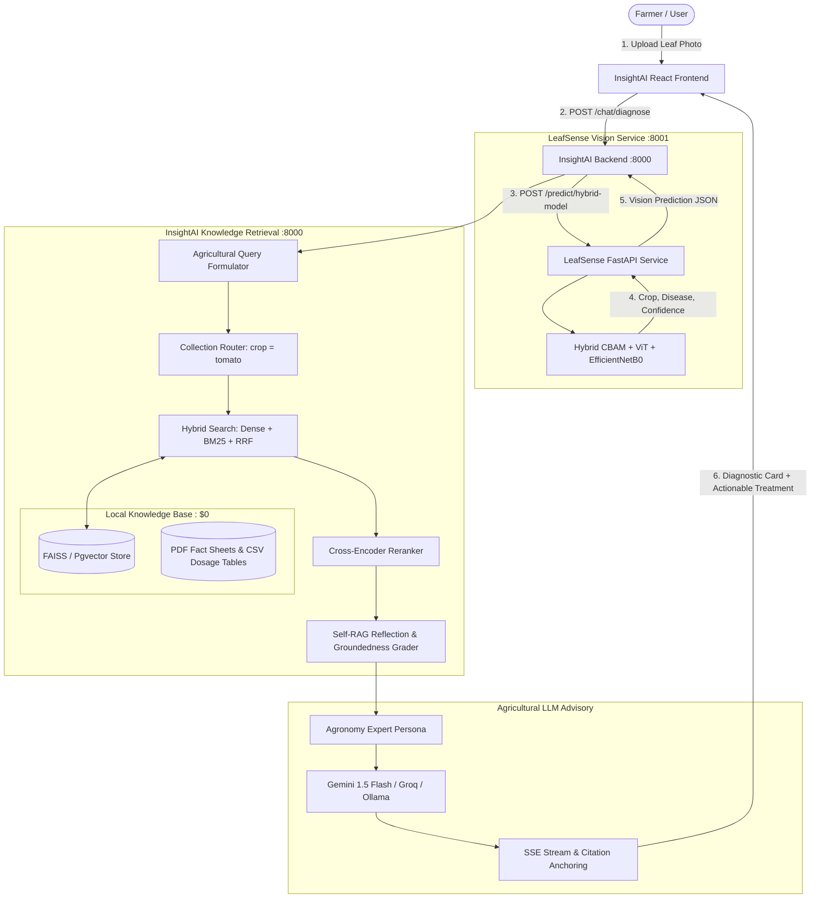

# Master Project Plan: LeafSense + InsightAI Multimodal Plant Disease Diagnostic & Treatment System

---

## 1. Executive Summary & Vision

**InsightAI-RAG** is being upgraded into an end-to-end **Multimodal Agricultural Disease Diagnosis & Treatment Advisory Platform** powered by:
1. **LeafSense Vision Engine**: A deep learning hybrid vision classifier (CBAM + ViT + EfficientNetB0, 38 PlantVillage disease classes, 98.95% accuracy) running on port `8001`.
2. **InsightAI Corrective RAG Engine**: A hybrid vector retrieval and state-graph multi-agent system on port `8000` providing grounded treatment plans, organic remedies, chemical fungicide dosages, and agricultural extension citations.

### Core Value Proposition
- **Farmers & Gardeners**: Upload a leaf photo $\rightarrow$ get instant visual disease diagnosis with confidence score $\rightarrow$ receive step-by-step organic and chemical treatment instructions grounded in verified university extension literature.
- **Cost**: **$0.00** (100% local and free tier: local PyTorch/TensorFlow vision model, local `all-MiniLM-L6-v2` embeddings, local FAISS/pgvector, free Gemini/Groq LLM tier).

---

## 2. End-to-End System Architecture

---

## 3. Knowledge Base Strategy (The 38 Target Classes)

The knowledge base covers the **38 agricultural plant and disease classes** supported by the LeafSense vision model:

### Target Crops & Disease Coverage
- **Tomato (10 classes)**: Bacterial spot, Early blight, Late blight, Leaf mold, Septoria leaf spot, Spider mites, Target spot, Yellow leaf curl virus, Mosaic virus, Healthy.
- **Potato (3 classes)**: Early blight, Late blight, Healthy.
- **Corn / Maize (4 classes)**: Gray leaf spot (Cercospora), Common rust, Northern leaf blight, Healthy.
- **Apple (4 classes)**: Apple scab, Black rot, Cedar apple rust, Healthy.
- **Grape (4 classes)**: Black rot, Esca (Black Measles), Leaf blight (Isariopsis), Healthy.
- **Bell Pepper (2 classes)**: Bacterial spot, Healthy.
- **Strawberry (2 classes)**: Leaf scorch, Healthy.
- **Cherry (2 classes)**: Powdery mildew, Healthy.
- **Peach (2 classes)**: Bacterial spot, Healthy.
- **Orange (1 class)**: Citrus greening (Huanglongbing).
- **Squash (1 class)**: Powdery mildew.
- **Blueberry, Raspberry, Soybean (3 classes)**: Healthy baseline.

### Data Ingestion Formats
1. **Primary Guides (PDFs)**: High-resolution agricultural extension fact sheets from **UC Davis IPM**, **Cornell Cooperative Extension**, **Penn State PlantVillage**, and **USDA ARS**.
   - Contains: Pathogen biology, life cycles, visual symptoms, cultural/prevention controls, organic treatments.
2. **Treatment Reference Tables (CSV / Markdown)**:
   - Columns: `crop, disease, pathogen_type, organic_remedy, chemical_active_ingredient, dosage_per_liter, spray_interval_days, pre_harvest_interval_days, safety_notes`.

---

## 4. Phased Implementation Roadmap

### Phase 1: LeafSense Vision Service Health & Dual Launcher
- [ ] Create `LeafSense/backend/start.ps1` with port `8001` binding.
- [ ] Update `start-local.ps1` in project root to start both **LeafSense (8001)** and **InsightAI (8000)** simultaneously with unified health monitoring.
- [ ] Add graceful fallback in frontend (`Diagnose.jsx`) displaying an alert when the vision service is starting or offline.

### Phase 2: Plant Disease Knowledge Base & Bulk Ingestion Pipeline
- [ ] Create directory structure: `data/plant_disease_docs/{crop_name}/` (e.g. `tomato/`, `apple/`, `corn/`).
- [ ] Build `backend/scripts/bulk_ingest.py` supporting batch extraction, automatic collection tagging (`collection=crop`), and progress checkpoints.
- [ ] Create structured CSV dosage table: `data/plant_disease_docs/treatment_dosage_matrix.csv`.
- [ ] Ingest initial seed pack of fact sheets across the 38 classes into local FAISS/pgvector ($0 cost).

### Phase 3: Agricultural RAG Pipeline & Prompt Specialization
- [ ] Upgrade hybrid search in `hybrid_search.py` to **Reciprocal Rank Fusion (RRF)**.
- [ ] Add `collection` filter routing in `router.py` so LeafSense predictions automatically restrict retrieval to the identified crop's documents.
- [ ] Specialize `Agronomy / Plant Pathologist Persona` in `prompt_builder.py` outputting structured sections:
  1. **Diagnosis & Severity Assessment**
  2. **Immediate Action Steps (First 24–48 Hours)**
  3. **Organic & Biological Control Remedies**
  4. **Chemical Fungicide/Bactericide Protocols with Dosages**
  5. **Long-Term Prevention & Field Sanitation**
  6. **Cited Extension References**

### Phase 4: Frontend UI/UX Redesign for Agricultural Diagnosis
- [ ] Revamp `frontend/src/pages/Diagnose.jsx`:
  - Drag-and-drop or camera photo upload with instant image preview.
  - Interactive prediction badge with confidence bar and crop tag.
  - Collapsible treatment action cards (Organic vs Chemical).
  - Dosage Calculator widget (enter field size in acres/sq ft $\rightarrow$ calculates required spray volume).
  - PDF citation view with page jump and term highlights.

### Phase 5: Testing, Evaluation & Benchmark Suite
- [ ] Add unit tests in `backend/tests/test_vision_diagnose.py` with mock LeafSense responses.
- [ ] Add frontend Vitest tests in `frontend/src/pages/Diagnose.test.jsx`.
- [ ] Create an offline agricultural evaluation dataset in `backend/eval/` with 38 disease test cases evaluating **Groundedness**, **Context Recall**, and **Treatment Accuracy**.

---

## 5. Clean Repository Organization

### Keep / Core Files
- `backend/app/services/vision_client.py`: LeafSense HTTP client.
- `backend/app/services/rag/`: Modular RAG pipeline (`router.py`, `retrieval_grader.py`, `reflection_engine.py`, `stream_adapter.py`).
- `backend/app/services/agent_graph/`: StateGraph engine for multi-agent workflows.
- `frontend/src/pages/Diagnose.jsx`: Plant diagnosis interface.
- `docs/FINAL_PROJECT_PLAN.md`: This master specification.

### Cleanup / Obsolete Files
- Consolidate legacy scratch docs (`SESSION_multiuser_multimodal.md`, redundant feature prompt notes) into `docs/` archive.
